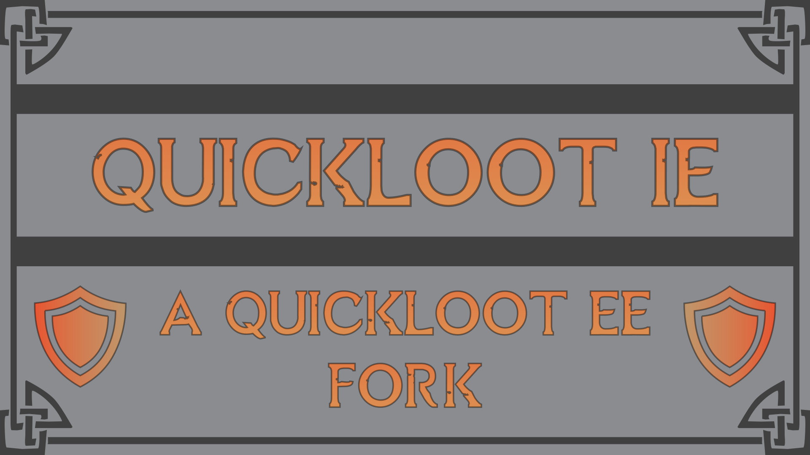

# QuickLootIE

QuickLoot IE allows you to look through and take items from containers without the need to open 
the inventory screen every time. Compared to its predecessor [QuickLoot EE](https://www.nexusmods.com/skyrimspecialedition/mods/69980), 
this version comes with a whole host of new features, improved compatibility with other mods, 
and expanded configuration options.

_Special thanks to Faen90 and AtomCrafty for helping with this project. 
This would have taken longer if not outright impossible without them!_

For more information about QuickLoot IE, please visit the [Nexus Page](https://www.nexusmods.com/skyrimspecialedition/mods/120075).

## Build Requirements

### Tools
* [Spriggit](https://github.com/Mutagen-Modding/Spriggit)
	* Below are instructions for the CLI version
* [Caprica](https://github.com/Orvid/Caprica)
	* To compile the papyrus scripts
	* Due to the scripts being declared as native, Skyrim's CK will not be able to compile them
* [PowerShell](https://github.com/PowerShell/PowerShell/releases/latest)
* [Visual Studio Community 2022](https://visualstudio.microsoft.com/) or any other C++23 compiler
	* Desktop development with C++

* One of the following:
	* [XMake](https://xmake.io)
	* [CMake](https://cmake.org/download/)]
		* Add this to your `PATH`	
		* If you're using CMake:
			* [Vcpkg](https://github.com/microsoft/vcpkg)
			* Add the environment variable `VCPKG_ROOT` with the value as the path to the folder containing vcpkg


## Building Instructions

### Using XMake
```bat
# Cloning the repo with the --recursive flag to init the submodules
git clone https://github.com/MissCorruption/QuickLootIE --recursive
cd QuickLootIE

# Building the xmake project
xmake build

# Building the ESP File
Path/To/Spriggit.CLI.exe deserialize --InputPath Source\ESP --OutputPath QuickLootIE.esp
```

### Using CMake
```bat
# Register Visual Studio as a Generator
* Open `x64 Native Tools Command Prompt`
* Run `cmake`
* Close the cmd window

# Cloning the repo with the --recursive flag to init the submodules
git clone https://github.com/MissCorruption/QuickLootIE --recursive
cd QuickLootIE

# Building the Cmake project
cmake --preset ALL
cmake --build build --config Release

# Building the ESP File
Path/To/Spriggit.CLI.exe deserialize --InputPath Source\ESP --OutputPath QuickLootIE.esp
```


## End User Dependencies
* [Address Library for SKSE Plugins](https://www.nexusmods.com/skyrimspecialedition/mods/32444)
* [Microsoft Visual C++ Redistributable for Visual Studio 2022](https://learn.microsoft.com/en-us/cpp/windows/latest-supported-vc-redist?view=msvc-170)
* [SKSE64](https://skse.silverlock.org/)
* [SkyUI](https://www.nexusmods.com/skyrimspecialedition/mods/12604)
* [PapyrusUtil SE - Modders Scripting Utility Functions](https://www.nexusmods.com/skyrimspecialedition/mods/13048)
* [Inventory Interface Information Injector](https://www.nexusmods.com/skyrimspecialedition/mods/85702)
	* Not required for the mod to function, only required if you want to benefit from it's integration.

## Credits
* [ilian53](https://github.com/Eloquence4) for the original QuickLootEE
* [Parapets](https://github.com/Exit-9B) for the PR for Inventory Interface Information Injector integration
* [AtomCrafty](https://github.com/AtomCrafty) for major contributions to the codebase, notably the sorting system
* [Faen90](https://github.com/Faen668) for major contributions to the codebase, notably the MCM
* [Noggog](https://github.com/Noggog) for Spriggit
* [Orvid](https://github.com/Orvid) for Caprica
* [Komegaki](https://github.com/Komegaki) for the new icon

